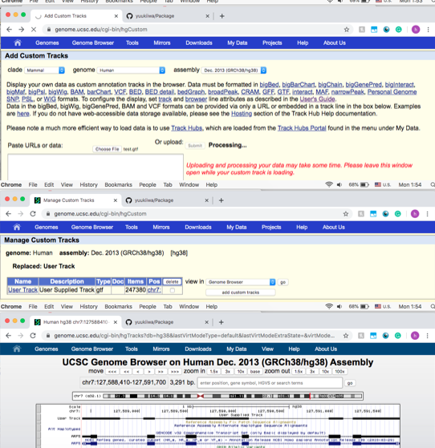

# Package
Get into R and type the following to install Package from Github:
```
devtools::install_github("yuukiiwa/Package")
```
Load Package:
```
library(Package)
```
Generate the inputs:
```
library(GenomicFeatures)
library(TxDb.Hsapiens.UCSC.hg38.knownGene)
exonsByTx <- exonsBy(TxDb.Hsapiens.UCSC.hg38.knownGene, by='tx', use.names=T)
txdbTables <- as.list(TxDb.Hsapiens.UCSC.hg38.knownGene)
```
Run the GTF-dataframe-generating function:
```
gtf <- TxDb_to_GTF(GRL,txdbTables)
```
Export the the GTF dataframe into a tsv (will be located in the Package directory):
```
write.table(gtf, file='test.gtf', quote=FALSE, sep='\t', col.names = FALSE, row.names = FALSE)
```
Upload test.gtf to UCSC to validate whether the dataframe is correctly displayed. Here is the result:

